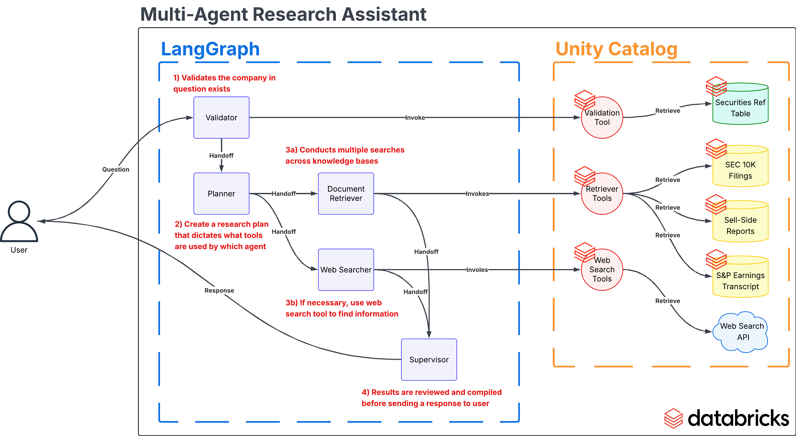

# LangGraph on Databricks

## Datasets:
* SEC 10K Business Section
* SEC 10k Other Section
* Earnings Call Transcript

## AI Models:
* Chat and Generation: `databricks-claude-sonnet-4`
* Text Embedding: `databricks-gte-large-en`

## Agent Frameworks:
* Databricks Mosaic AI Agent Framework
* Databricks Mosaic AI Agent Evaluation
* LangGraph

## Multi-Agent Graph Architecture
* Start with a `validator_agent` that looks-up from a table to make sure that the company that the user is referring to is valid and exists
* Then, passes to a `planner_agent` that decomposes the user question into an actionable plan with steps to take and the tools to use by which sub-agent in order to complete the task
* Next, passes to a `supervisor_agent` to review, coordinate, and delegate tasks to the sub-agents
* The sub-agents:
  * A comprehensive `document_retrieval_agent` that can retrieve information from various knowledge bases, such as SEC 10K filings, earnings call transcripts, or sell-side research reports.
  * **(WIP)** A `web_search_agent` that can retrieve information from the web in case internal knowledge bases are not sufficient to answer research questions.
  * **(WIP)** A `databricks_genie_agent` that can generate SQL and use it to query from datasets on Databricks to answer questions pertaining to structured datasets.
* Finally, the `supervisor_agent` will then compile the search results into a coherent, human-readable output that answers the initial user question.

**_Graph Visualized:_**

