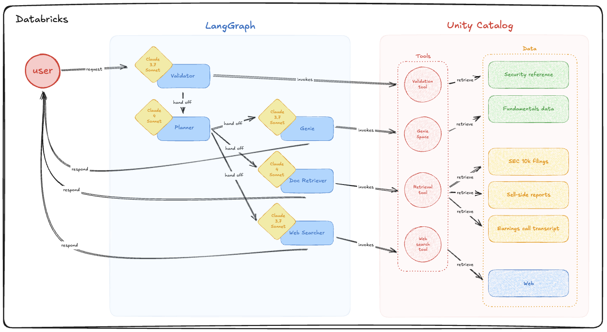

# LangGraph on Databricks

## Datasets:
* SEC 10K Business Section
* SEC 10k Other Section
* Earnings Call Transcript

## AI Models:
* Chat and Generation: `databricks-claude-sonnet-4`
* Text Embedding: `databricks-gte-large-en`

## Agent Frameworks:
* Databricks Mosaic AI Agent Framework
* Databricks Mosaic AI Agent Evaluation
* LangGraph

## Streamlined 3-Agent Graph Architecture
* Start with a `validator_agent` that looks-up from a table to make sure that the company that the user is referring to is valid and exists
* Then, passes to a `planner_agent` that decomposes the user question into an actionable plan with steps to take and the tools to use
* Finally, the `document_retrieval_agent` executes parallel searches across SEC filings and earnings transcripts, then synthesizes findings and provides the final user response

### Agent Details:
* **validator_agent**: Validates company existence using UC functions (uses `databricks-claude-3-7-sonnet`)
* **planner_agent**: Creates comprehensive research strategies (uses `databricks-claude-sonnet-4`) 
* **document_retrieval_agent**: Executes searches and synthesizes final response (uses `databricks-claude-sonnet-4`)
  * Tools: `search_sec_business_section`, `search_sec_other_sections`, `search_earnings_calls`
  * Handles both data retrieval AND response synthesis in a single agent
* **genie_agent**: (work-in-progress) Execute text-to-SQL-based query (uses `databricks-claude-3-7-sonnet`)
* **websearch_agent**: (work-in-progress) Executed searches on the web (uses `databricks-claude-3-7-sonnet`)

**_Graph Visualized:_**

