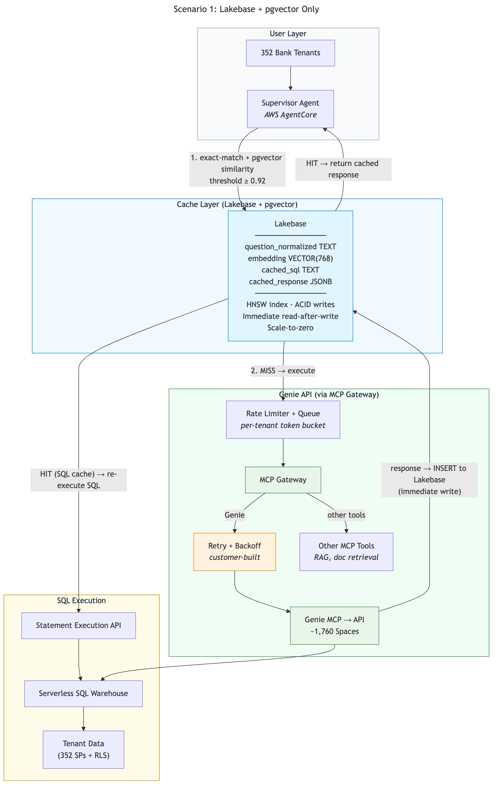
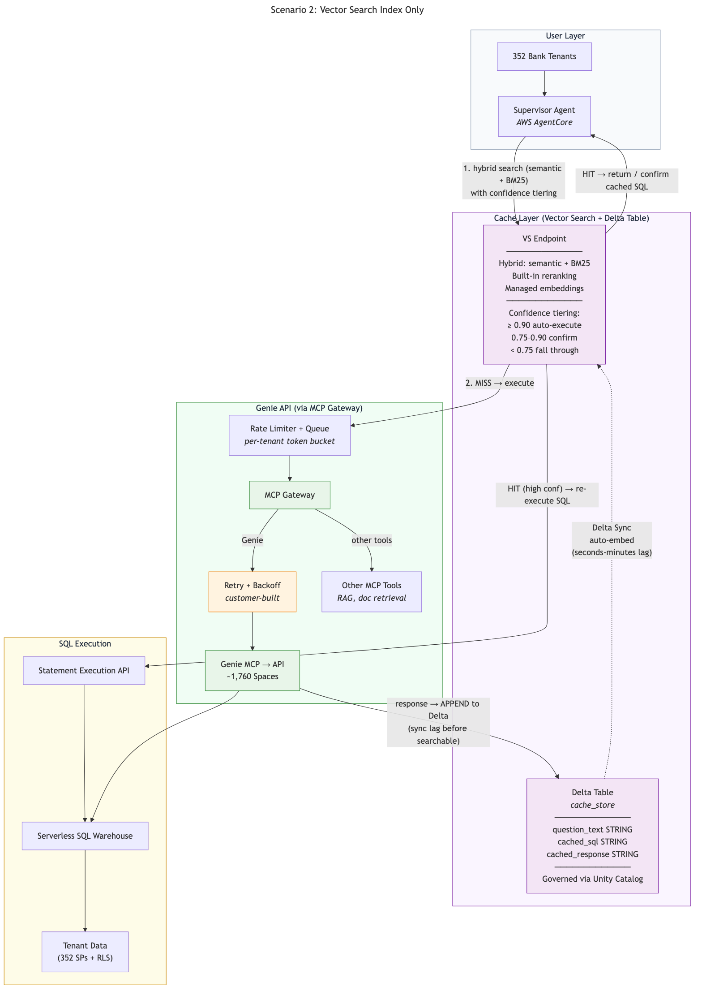
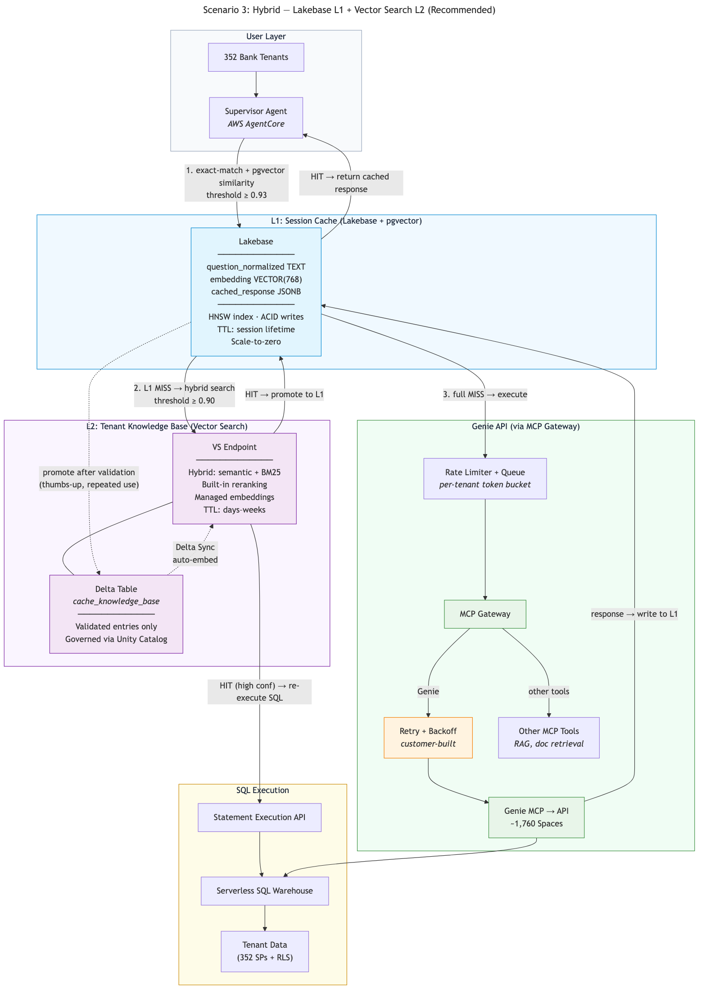

# Genie Query Caching

> **WIP — This project is a work in progress and not ready for use.**

Demonstrates three caching strategies for Databricks Genie API responses, reducing latency and API load by serving repeated or semantically similar questions from cache.

## Scenarios

| Scenario | Cache Layer | Key Benefit |
|----------|-------------|-------------|
| 1. Lakebase + pgvector | PostgreSQL with vector similarity | ACID writes, immediate read-after-write, scale-to-zero |
| 2. Vector Search Index | Delta table + managed embeddings | Unity Catalog governance, hybrid semantic + BM25 search |
| 3. Hybrid (Recommended) | L1: Lakebase session cache + L2: VS knowledge base | Fast session cache + durable cross-session knowledge base |

## Architecture

| Scenario 1 | Scenario 2 | Scenario 3 |
|:---:|:---:|:---:|
|  |  |  |

## Prerequisites

- Databricks workspace with **Genie Spaces** enabled and at least one Genie Space configured
- **Lakebase** instance with the pgvector extension (Scenarios 1 & 3)
- A Databricks **secret scope** with Lakebase credentials
- **Vector Search** endpoint (Scenarios 2 & 3)
- **Unity Catalog** with a catalog/schema for cache tables
- Run notebooks on **Serverless** compute or a cluster with network access to Lakebase

## Quick Start

1. Copy `configs.template.yaml` → `configs.yaml` and fill in your values
2. Run `0_setup.py` to create all infrastructure (tables, indexes, etc.)
3. *(Optional)* Run `seed_cache.py` to pre-populate caches with 5 Horizon Bank entries — the demo will show cache HITs immediately
4. Run any scenario notebook:
   - `1_lakebase_pgvector_cache.py` — simplest, Lakebase-only
   - `2_vector_search_cache.py` — Vector Search with confidence tiering
   - `3_hybrid_cache.py` — recommended two-tier approach

## Notebooks

| File | Purpose |
|------|---------|
| `0_setup.py` | Create catalog, schema, Lakebase tables with pgvector, Delta tables, VS endpoint and indexes |
| `seed_cache.py` | Pre-populate all 3 cache stores with 5 Horizon Bank seed entries |
| `1_lakebase_pgvector_cache.py` | Scenario 1: exact match + pgvector similarity (≥ 0.92) |
| `2_vector_search_cache.py` | Scenario 2: hybrid semantic + BM25 with 3-tier confidence scoring |
| `3_hybrid_cache.py` | Scenario 3: L1 Lakebase session cache + L2 VS knowledge base with promotion |
| `utils.py` | Shared helpers: retry/backoff, Genie API wrapper, embeddings, Lakebase connectivity |

## Configuration

See `configs.template.yaml` for all settings:

- **Unity Catalog** — catalog and schema for cache tables
- **Genie Space** — space ID and timeout
- **Lakebase** — host, port, database, secret scope/keys
- **Vector Search** — endpoint name, embedding model
- **Retry/backoff** — max attempts, base/max delay (decorrelated jitter)
- **Thresholds** — similarity thresholds for each cache layer
- **Demo questions** — sample questions used across all notebooks

## Key Design Decisions

- **Retry strategy**: Decorrelated jitter (`delay = min(max_delay, uniform(base_delay, prev_delay * 3))`) — avoids thundering herd while providing fast initial retries
- **Embedding model**: `databricks-gte-large-en` (768 dimensions) via Foundation Model API for Lakebase pgvector; managed embeddings for Vector Search
- **Lakebase connectivity**: `psycopg` (psycopg3) + `pgvector` Python package for native PostgreSQL vector search; credentials via Databricks Secrets
- **Vector Search**: Delta Sync indexes with managed embeddings and `HYBRID` query type (semantic + BM25)
- **Code structure**: Shared `utils.py` module imported by all notebooks; each notebook adds scenario-specific cache logic
