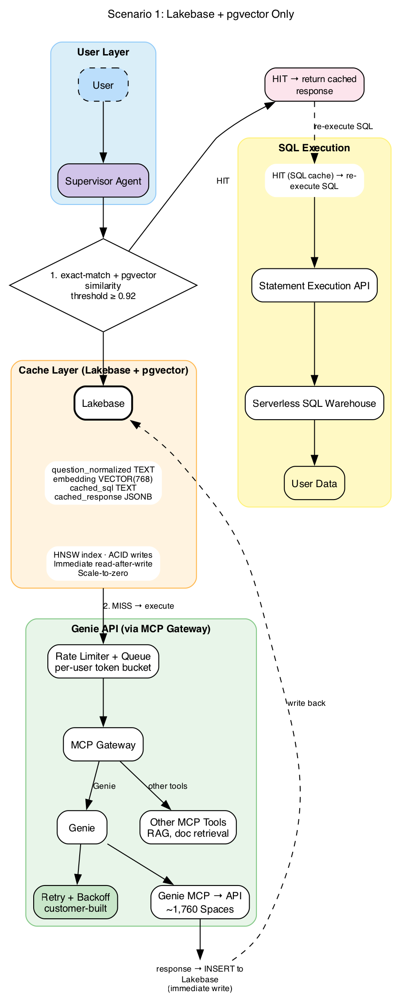
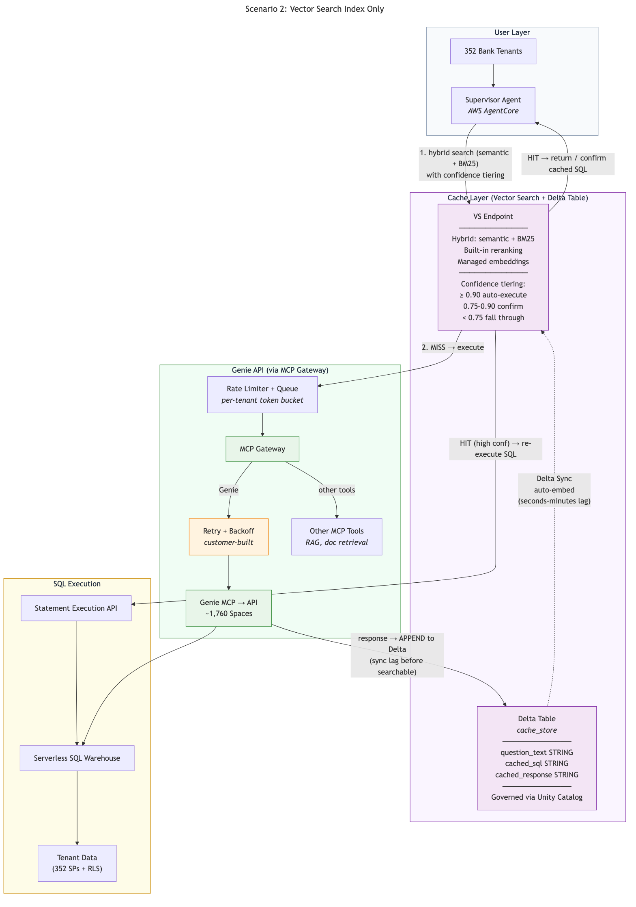
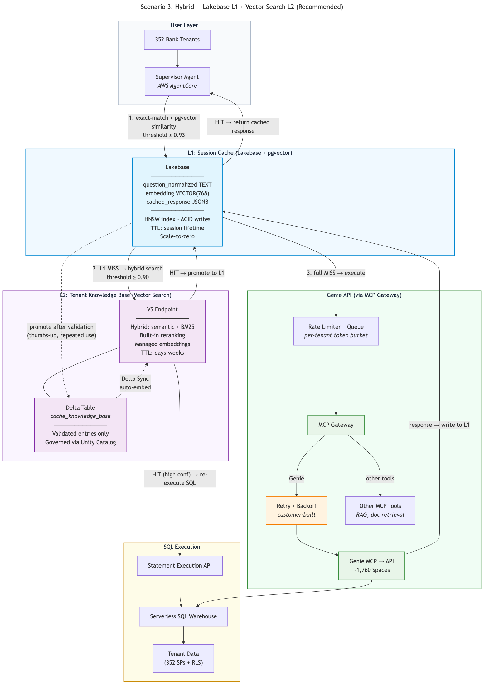

# Genie Query Caching

> **WIP — This project is a work in progress and not ready for use.**

Demonstrates three caching strategies for Databricks Genie API responses, reducing latency and API load by serving repeated or semantically similar questions from cache.

## Scenarios

| Scenario | Cache Layer | Key Benefit |
|----------|-------------|-------------|
| 1. Lakebase + pgvector | PostgreSQL with vector similarity | ACID writes, immediate read-after-write, scale-to-zero |
| 2. Vector Search Index | Delta table + managed embeddings | Unity Catalog governance, hybrid semantic + BM25 search |
| 3. Hybrid (Recommended) | L1: Lakebase session cache + L2: VS knowledge base | Fast session cache + durable cross-session knowledge base |

## Architecture

| Scenario 1 | Scenario 2 | Scenario 3 |
|:---:|:---:|:---:|
|  |  |  |

## Prerequisites

- Databricks workspace with **Genie Spaces** enabled and at least one **Genie Space configured over the demo data schema** created by `0_setup.py` (the scenario notebooks call Genie on cache misses, so without a Genie Space you need `seed_demo_cache: true` to keep every question a cache hit)
- **Lakebase** instance with the pgvector extension (Scenarios 1 & 3)
- A Databricks **secret scope** with Lakebase credentials
- **Vector Search** endpoint (Scenarios 2 & 3)
- **Unity Catalog** with a catalog/schema for cache tables
- Run notebooks on **Serverless** compute or a cluster with network access to Lakebase

## Quick Start

1. Copy `configs.template.yaml` → `configs.yaml` and fill in your values
2. Run `0_setup.py` — creates the demo data schema (self-contained banking dataset), all cache infrastructure (Lakebase table, Delta tables, VS endpoint + indexes), and optionally seeds the caches (`seed_demo_cache`, default `false`, so the demos start cold)
3. Run any scenario notebook:
   - `1_lakebase_pgvector_cache.py` — simplest, Lakebase-only
   - `2_vector_search_cache.py` — Vector Search with confidence tiering
   - `3_hybrid_cache.py` — recommended two-tier approach

Each scenario notebook walks a **cold pass** (cache miss → Genie API → cache write) followed by **warm passes** (cache hits), so run them right after `0_setup.py` to see the full progression.

## Notebooks

| File | Purpose |
|------|---------|
| `0_setup.py` | Create demo data schema, catalog/schema, Lakebase table with pgvector, Delta tables, VS endpoint/indexes, and optional cache seeding |
| `1_lakebase_pgvector_cache.py` | Scenario 1: exact match + pgvector similarity (≥ 0.92) |
| `2_vector_search_cache.py` | Scenario 2: hybrid semantic + BM25 with 3-tier confidence scoring — top tier auto-executes the cached SQL |
| `3_hybrid_cache.py` | Scenario 3: L1 Lakebase session cache + L2 VS knowledge base with L2 re-execution and L1→L2 promotion (thumbs-up or hit count) |
| `utils.py` | Shared helpers: retry/backoff, Genie API wrapper, embeddings, Lakebase connectivity |

## Configuration

See `configs.template.yaml` for all settings:

- **Unity Catalog** — catalog and schema for cache tables
- **Genie Space** — space ID and timeout
- **Lakebase** — host, port, database, secret scope/keys
- **Vector Search** — endpoint name, embedding model
- **Retry/backoff** — max attempts, base/max delay (decorrelated jitter)
- **Thresholds** — similarity thresholds for each cache layer
- **Promotion & TTL** — L1→L2 promotion hit-count threshold, L1 session TTL (Scenario 3)
- **Seeding** — `seed_demo_cache` flag to pre-populate caches (default off)
- **Demo questions** — sample questions used across all notebooks

## Key Design Decisions

- **Retry strategy**: Decorrelated jitter (`delay = min(max_delay, uniform(base_delay, prev_delay * 3))`) — avoids thundering herd while providing fast initial retries; non-transient errors (auth, NOT_FOUND) fail immediately instead of being retried
- **Genie API approach**: Uses the [Databricks Python SDK](https://docs.databricks.com/aws/en/genie/conversation-api) (`start_conversation_and_wait`) rather than the REST API (requires manual polling) or [Managed MCP](https://docs.databricks.com/aws/en/generative-ai/mcp/managed-mcp) (designed for AI agent tool use, not programmatic caching where structured response parsing is required)
- **Embedding model**: [`databricks-qwen3-embedding-0-6b`](https://www.databricks.com/blog/sota-embedding-model-agentic-workflows-now-public-preview) (1024 dimensions, native output) via Foundation Model API for Lakebase pgvector; managed embeddings for Vector Search. Supports optional `instruction` parameter (passed via the serving API's `extra_params`) for task-specific retrieval boost (1-5%)
- **Lakebase connectivity**: `psycopg` (psycopg3, autocommit) + `pgvector` Python package for native PostgreSQL vector search; credentials via Databricks Secrets
- **Cache upserts**: Lakebase `ON CONFLICT (question_normalized, session_id)` and Delta `MERGE` — notebook re-runs refresh entries instead of duplicating them, and one session's L1 entry can never be overwritten by another session asking the same question
- **Vector Search**: Delta Sync indexes with managed embeddings and `HYBRID` query type (semantic + BM25), via the `databricks-ai-search` package
- **Code structure**: Shared `utils.py` module imported by all notebooks; each notebook adds scenario-specific cache logic
